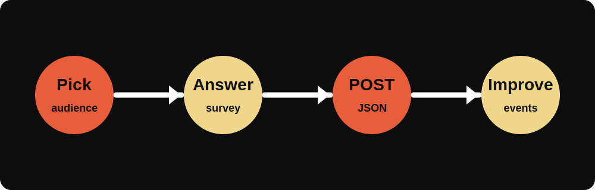
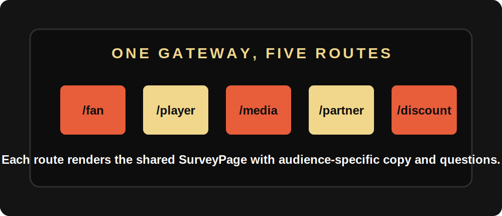

# SLB Fan Feedback


SLB Fan Feedback is a Super League Basketball post-event survey app. It gives each audience a focused, shareable route, collects ratings and open-text answers, and posts one tidy JSON payload to a configured survey endpoint.

The app is built with TanStack Start, React, Vite, Tailwind CSS, and shadcn-style UI primitives. It is designed for quick deployment after an event: set the submission endpoint, share the right audience URL, and start collecting usable feedback.

## What It Does

- Presents an admin-gated landing page with direct links for every survey audience.
- Serves dedicated survey pages for fans, players/team staff, media, partners/sponsors, and discount-ticket recipients.
- Tracks progress as each respondent completes ratings, choices, email, and optional comments.
- Posts responses as JSON to `VITE_SURVEY_ENDPOINT`, with a built-in fallback endpoint for local testing.
- Uses branded SLB artwork, browser icons, and social preview metadata from local project assets.



## Audience Routes



| Route | Audience | Best use |
| --- | --- | --- |
| `/` | Admin gateway | Sign in and choose the right survey link. |
| `/fan` | Fans and spectators | Send after matchday attendance or viewing. |
| `/player` | Players and team staff | Capture operational and competition feedback. |
| `/media` | Press and broadcast | Learn what helped or blocked event coverage. |
| `/partner` | Partners and sponsors | Review activation, hospitality, and commercial experience. |
| `/discount` | Discount-ticket respondents | Understand offer-led attendance and value perception. |

## Quick Start

Install dependencies:

```bash
bun install
```

Run the local dev server:

```bash
bun run dev
```

Open `http://localhost:8080`, sign in with the configured landing-page credentials, and choose a survey route.

To bind explicitly to localhost, use:

```bash
bun run dev:localhost
```

If you do not use Bun, the same scripts also work with npm:

```bash
npm install
npm run dev
```

## Configuration

Create a `.env.local` file when you want submissions to go somewhere other than the fallback endpoint:

```bash
VITE_SURVEY_ENDPOINT=https://example.com/webhook/slb-feedback
```

The survey payload is posted as JSON:

```json
{
  "audience": "fan",
  "submittedAt": "2026-06-08T09:00:00.000Z",
  "answers": {
    "overall": 5,
    "recommend": 5,
    "ratings": {
      "atmosphere": 5
    },
    "choices": {},
    "highlight": "The atmosphere in the fourth quarter.",
    "improve": "More food options near the lower bowl.",
    "email": "fan@example.com",
    "consent": true
  },
  "meta": {
    "userAgent": "Browser user agent",
    "page": "/fan"
  }
}
```

Admin access on the gateway is controlled in `src/routes/index.tsx` by `AUTH_USER`, `AUTH_PASS`, and `AUTH_KEY`. Treat those values as lightweight event-gate credentials, not as a secure identity system.

## Project Structure

```text
src/
  assets/                 SLB images used by the app UI
  components/survey/      Shared survey renderer and POST logic
  components/ui/          Reusable UI primitives
  routes/                 TanStack file routes for each audience
  lib/                    Error handling helpers
public/                   Favicons, manifest, and social preview art
docs/images/              README drawings and diagrams
```

## Editing Survey Content

Each audience route imports `SurveyPage` and passes a `SurveyConfig`. To change copy or questions:

1. Open the relevant route in `src/routes/`.
2. Update the `title`, `intro`, `ratings`, `choices`, or prompt fields.
3. Keep each question `id` stable if downstream reporting already depends on it.
4. Run the app and submit a test response before sharing the link.

## Build And Deploy

Create a production build:

```bash
bun run build
```

Preview the built app:

```bash
bun run preview
```

The repository includes `wrangler.jsonc` for Cloudflare-oriented deployment. Set environment variables in your deployment platform so the production app posts to the correct survey endpoint.

## Quality Checks

Useful checks before sending survey links:

```bash
bun run lint
bun run build
```

Manual QA checklist:

- The gateway accepts the expected credentials.
- Every audience route loads directly from a fresh tab.
- A test submission reaches the configured endpoint.
- The browser tab shows the SLB feedback icon.
- Social previews use `/og-preview.svg`.

## Notes For Operators

- Keep the endpoint stable for the duration of a campaign so responses land in one reporting stream.
- Export or archive responses before changing question IDs.
- Use audience-specific links in emails, QR codes, and partner comms to avoid mixing respondent groups.
- The app stores only the gateway session flag in `sessionStorage`; survey answers are submitted to the configured endpoint.
